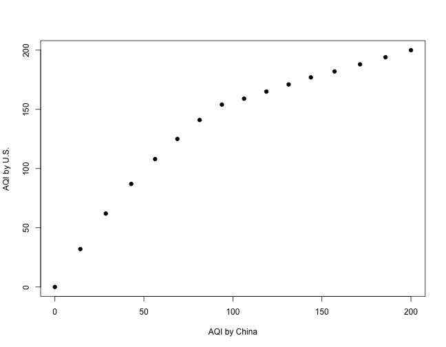
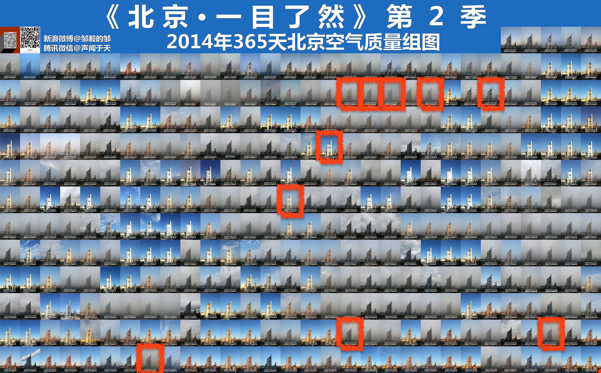
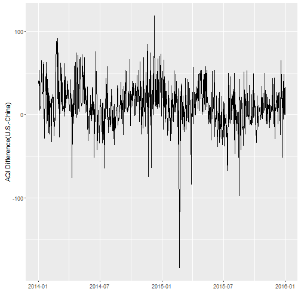
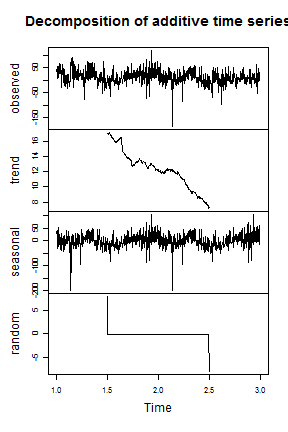

Explore Reasons Behind Dramatic Difference between AQI's by U.S. and Chinese government
========================================================
author: Li Luo, Zhuangye Chen
date: 02/10/2016
font-family: 'Helvetica'

Overview
========================================================

- Background
- Adjustment Based On Breakpoints
- Dates with 10 Biggest AQI Difference
- Stationary Test
- Seasonal Trend Decomposition

Background
========================================================
How is Air Quality Index (AQI) calculated?

- For the pollutant $p$, define IAQI (Individual AQI) as:

$$
IAQI_p = \frac{I_{high} - I_{low}}{C_{high} - C_{low}} (C - C_{low}) + I_{low}
$$
$C$ = the pollutant concentration <br/>
$C_{low}$= the concentration breakpoint that is $\le C$ <br/>
$C_{high}$= the concentration breakpoint that is $\ge C$ <br/>
$I_{low}$= the index breakpoint corresponding to $C_{low}$ <br/>
$I_{high}$= the index breakpoint corresponding to $C_{high}$

- $$AQI = max\{ IAQI_1, IAQI_2, IAQI_3,\dots, IAQI_n\}$$

Different Breakpoints
========================================================
PM2.5 ($\mu g/m^3$)  | AQI by China | AQI by U.S.
------------- | ------------- | -------------
0 | 0	|	0
10|14.3|32
30|42.9|87
50|68.8|125
70|93.8|154
90|118.8|165
100|131.3|171
120|157.1|182
150|**200.0**|**200**
170|220.0|220
200|250.0|250
300|350.0|350

Adjustment Based On Breakpoints
========================================================


$$
{\tiny
AQI_{U.S.} = 2.54\times 10^{-5} AQI_{China}^3 - 1.31\times 10^{-2} AQI_{China}^2 + 2.59 AQI_{China}
}
$$

10 Biggest AQI Difference In Photos
========================================================


Stationary Test
========================================================

In order to see if the difference in AQI reported by China and U.S. exsits, we check the stationarity of this time series with ADF test. 



Stationary Test Result
========================================================


```r
zeromean <- aqidiff$aqi_diff-mean(aqidiff$aqi_diff)
library(tseries)
pvalue <- adf.test(zeromean)$p.value
pvalue
```

```
[1] 0.01
```

The test shows the data is stationary. Taking into account of difference average  12.1317722, we can conclude that the difference of AQI reported by China and US really exists.

Seasonal Trend Decomposition
========================================================


```r
aqidiff.ts<-ts(aqidiff$aqi_diff,frequency=365)
aqidiff.de<-decompose(aqidiff.ts,type="additive")
plot(aqidiff.de)
```



